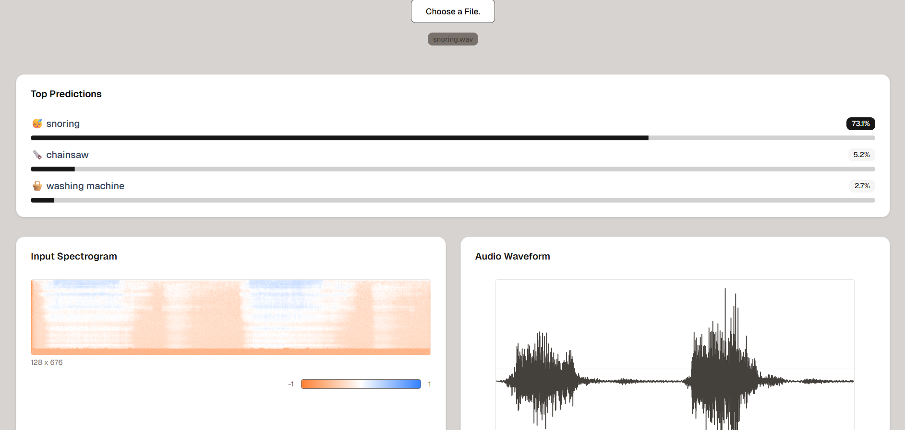

# Neurotone

Neurotone is an end-to-end full-stack deep learning project designed to classify input audio files with high accuracy. It leverages a ResNet-inspired Convolutional Neural Network (CNN) architecture, enhanced with residual blocks to effectively capture complex audio patterns. Before training, raw audio signals are converted into Mel Spectrograms, providing a rich time-frequency representation that helps the model learn subtle acoustic features.

This project demonstrates the complete workflow: from data preprocessing and model training to deployment and frontend integration, making it a practical showcase of applying deep learning to audio intelligence.

## Features

* ResNet-style Deep CNN – Residual architecture with Batch Normalization for robust audio classification.

* Serverless GPU Training & Inference on Modal – Train and deploy models seamlessly in the cloud without infrastructure overhead.

* Next.js Interactive Dashboard – Built with Tailwind CSS and shadcn/ui for a clean, modern UI.

* Real-time Classification – Predicts audio classes on the fly with confidence scores.

* Rich Visualizations – Explore internal CNN feature maps, input waveforms, and Mel spectrograms.

### Demo
[Neurotone](https://neurotone-one.vercel.app/)

